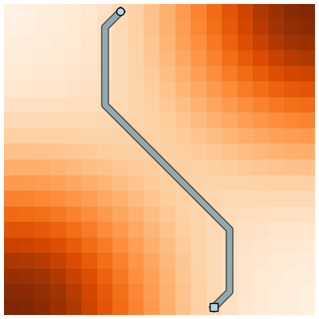
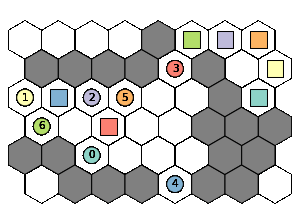

# Pathfinding

Pathfinding is the problem of finding the best route between two points.

<p align="left">
    
</p>

There are several pathfinding algorithms available here. Some algorithms do not guarantee that they will find the shortest path. Some algorithms can find the shortest path only on an unweighted graph.

| Algorithm   | Class name  | Finds the shortest path on an unweighted graph | Finds the shortest path on a weighted graph |
| ----------- | ----------- |----------- | ----------- |
| Depth-first search | DFS | False | False |
| Breadth-first search | BFS | True | False |
| Bidirectional Breadth-first search | BiBFS | True | False |
| Dijkstra | Dijkstra | True | True |
| Bidirectional Dijkstra | BiDijkstra | True | True |
| A* | AStar | True | True |
| Bidirectional A* | BiAStar | True | True |

Example:

```python
from w9_pathfinding import Graph, Dijkstra

graph = Graph(num_vertices=4)
graph.add_edges(
    [
        (0, 1, 1),  # start, end, cost
        (0, 2, 3),
        (0, 3, 4),
        (1, 3, 1),
        (2, 3, 1),
    ]
)

dijkstra = Dijkstra(graph)
path = dijkstra.find_path(start=0, goal=3)
print(path)  # [0, 1, 3]
```

# Multi-Agent Path Finding (MAPF)

Multi-Agent Path Finding (MAPF) is the problem of finding collision-free paths for a group of agents from their location to an assigned target.

<p align="left">
    
</p>

Currently implemented:

- HCAStar - Hierarchical Cooperative A*
- WHCAStar - Windowed Hierarchical Cooperative A*
- CBS - Conflict Based Search

Example:

```python
from w9_pathfinding import Grid, WHCAStar

grid = Grid(
    # -1 - unwalkable cell
    # >= 0 - walkable, value is the cost of moving to this cell
    weights =[
        [1,  1,  1, -1],
        [-1, 1,  1, -1],
        [1,  1, -1, -1],
        [1,  1,  1,  1],
    ],
    edge_collision=True, # head to head collisions are not allowed
)

whcastar = WHCAStar(grid)
paths = whcastar.mapf(starts=[(0, 0), (1, 1)], goals=[(2, 0), (1, 0)])
print(paths)  # [[(0, 0), (1, 0), (2, 0)], [(1, 1), (1, 1), (1, 0)]]
```

# Types of graphs

There are several types of graphs available:

 - Graph - Generic graph, directed or undirected
 - Grid - Two-dimensional grid
 - Grid3D - Three-dimensional grid
 - HexGrid - Hexagonal grid

Any algorithm can work with any type of graph. But there are a few limitations:

1. AStar and BiAStar will work with generic graph only if you provide coordinates for each vertex. You can add coordinates using `set_coordinates` method.
2. An undirected generic graph does not support `edge_collision` option. You still can use MAPF algorithms with this kind of graph, but it's impossible right now to mark head to head collisions as illegal actions.

# Visualization

Visualization is only available for Grid and HexGrid. To use visualization, you need to install `matplotlib`.

Example:

```python
from w9_pathfinding import HexGrid
from w9_pathfinding.visualization import plot_grid, animate_grid

grid = HexGrid(
    weights =[
        [1,  1,  1, -1],
        [-1, 1,  1, -1],
        [1,  1, -1, -1],
        [1,  1,  1,  1],
    ]
)

agents = [
    {'start': (0, 0), 'goal': (2, 0), 'path': [(0, 0), (1, 0), (2, 0)]},
    {'start': (1, 1), 'goal': (1, 0), 'path': [(1, 1), (1, 1), (1, 0)]},
]

# plot_grid returns a static image useful in the pathfinding problem
fig = plot_grid(grid, agents)

# animate_grid returns an animation useful in the mapf problem
anim = animate_grid(grid, agents)
# HTML(anim.to_html5_video())  # visualize
# anim.save("out.gif", fps=10, dpi=200)  # save as a gif
```

# Installation

1. Setup virtual environment

2. Install Cython, it is needed to wrap the C++ code:

    ```bash
    pip install cython
    ```

3. Clone this repository and install pathfinding from the local filesystem:

    ```bash
    pip install pathfinding/
    ```
