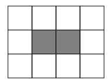

Usage
===============

Pathfinding in a graph
------------------------------------

For this basic usage example, we'll demonstrate how to perform pathfinding
in the simplest environment: a directed :doc:`graph </envs/Graph>`.

First, we create a small weighted directed graph:

.. code-block:: python

    from w9_pathfinding.envs import Graph

    graph = Graph(
        num_vertices=4,
        edges=[(0, 1, 2.0), (0, 2, 0.1), (1, 3), (2, 3)],  # [(start, end, weight), ...]
    )

This graph looks like the following:

.. mermaid::

     graph LR;
         0 -- 2.0 --> 1;
         0 -- 0.1 -->2;
         1 -- 1 --> 3;
         2 -- 1 -->3;

We want to find the optimal path from node `0` to node `3`.
Since the graph is **weighted**, we need to choose an algorithm that guarantees
an optimal solution in such environments. One such algorithm is
:ref:`Dijkstra's algorithm <Dijkstra>`:

.. code-block:: python

    from w9_pathfinding.pf import Dijkstra

    finder = Dijkstra(graph)
    path = finder.find_path(0, 3)

    print(path)  # [0, 2, 3]
    print(graph.calculate_cost(path))  # 1.1

Pathfinding in a 2D grid
------------------------------------

There are several types of :doc:`environments </envs/index>` in this library,
and we can work with any of them. In this example, we'll demonstrate how to
perform pathfinding in a :doc:`2D grid </envs/Grid>` environment.

First, let's create a small grid with obstacles:

.. code-block:: python

    from w9_pathfinding.envs import Grid

    grid = Grid(width=4, height=3)
    grid.add_obstacle((1, 1))
    grid.add_obstacle((2, 1))

This grid looks like the following:

Now we want to find the optimal path from the top-left corner `(0, 0)` to the
top-right corner `(3, 0)`. We can use the same Dijkstra's algorithm as we did
for graphs. The syntax is nearly identical:

.. code-block:: python

    from w9_pathfinding.pf import Dijkstra

    finder = Dijkstra(grid)
    path = finder.find_path((0, 0), (3, 0))

    print(path)  # [(0, 0), (1, 0), (2, 0), (3, 0)]
    print(grid.calculate_cost(path))  # 3.0

By default, each cell in the grid has a movement cost (weight) of `1.0`. So we currently
have an unweighted grid where all cells are equally cheap. But we can increase the
weight of a specific cell to make it less attractive for the pathfinder:

.. code-block:: python

    grid.update_weight((2, 0), 9.9)

    path = finder.find_path((0, 0), (3, 0))

    print(path)  # [(0, 0), (0, 1), (0, 2), (1, 2), (2, 2), (3, 2), (3, 1), (3, 0)]
    print(grid.calculate_cost(path))  # 7.0

Now the algorithm chooses the bottom path. Even though it's longer in terms of
the number of steps, it's cheaper in terms of the total cost.

Resumable Search
------------------------------------

What if we want to find the optimal path from one node (`start_node`) to many other nodes?
Sure, we could create a Dijkstra finder (or use any other pathfinding algorithm)
and call `[find_path(start_node, n) for n in nodes]`. But this would be inefficient,
because each call would re-run the entire search from scratch.

Instead, we can use **Resumable Search**, which reuses intermediate results efficiently
for multiple path queries from the same start node.

There are two options:

- :ref:`ResumableBFS` — for unweighted environments
- :ref:`ResumableDijkstra` — for weighted environments

Let's look at how to use `ResumableDijkstra` on a weighted grid:

.. code-block:: python

    from w9_pathfinding.envs import Grid
    from w9_pathfinding.pf import ResumableDijkstra

    grid = Grid(width=4, height=3)
    grid.add_obstacle((1, 1))
    grid.add_obstacle((2, 1))
    grid.update_weight((2, 0), 1.5)

    finder = ResumableDijkstra(grid, start_node=(0, 0))

    path1 = finder.find_path((3, 0))
    path2 = finder.find_path((3, 1))
    path3 = finder.find_path((3, 2))

    print(path1)  # [(0, 0), (1, 0), (2, 0), (3, 0)]
    print(path2)  # [(0, 0), (1, 0), (2, 0), (3, 0), (3, 1)]
    print(path3)  # [(0, 0), (0, 1), (0, 2), (1, 2), (2, 2), (3, 2)]

Multi-Agent Pathfinding (MAPF)
------------------------------------

todo

Pathfinding with dynamic obstacles
------------------------------------

todo
