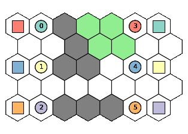
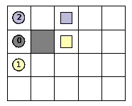

Usage
===============

Pathfinding in a graph
------------------------------------

For this basic usage example, we'll demonstrate how to perform pathfinding
in the simplest environment: a directed :doc:`graph </envs/Graph>`.

First, we create a small weighted directed graph:

.. code-block:: python

    from w9_pathfinding.envs import Graph

    graph = Graph(
        num_vertices=4,
        edges=[(0, 1, 2.0), (0, 2, 0.1), (1, 3), (2, 3)],  # [(start, end, weight), ...]
    )

This graph looks like the following:

.. graphviz::

    digraph directed_graph {
        rankdir=LR;
        0 -> 1 [label="2.0"];
        0 -> 2 [label="0.1"];
        1 -> 3 [label="1"];
        2 -> 3 [label="1"];
    }

We want to find the optimal path from node `0` to node `3`.
Since the graph is **weighted**, we need to choose an algorithm that guarantees
an optimal solution in such environments. One such algorithm is
:ref:`Dijkstra's algorithm <Dijkstra>`:

.. code-block:: python

    from w9_pathfinding.pf import Dijkstra

    finder = Dijkstra(graph)
    path = finder.find_path(0, 3)

    print(path)  # [0, 2, 3]
    print(graph.calculate_cost(path))  # 1.1

Pathfinding in a 2D grid
------------------------------------

There are several types of :doc:`environments </envs/index>` in this library,
and we can work with any of them. In this example, we'll demonstrate how to
perform pathfinding in a :doc:`2D grid </envs/Grid>` environment.

First, let's create a small grid with obstacles:

.. code-block:: python

    from w9_pathfinding.envs import Grid

    grid = Grid(width=4, height=3)
    grid.add_obstacle((1, 1))
    grid.add_obstacle((2, 1))

This grid looks like the following:

.. image:: _static/simple_grid.svg

Now we want to find the optimal path from the top-left corner `(0, 0)` to the
top-right corner `(3, 0)`. We can use the same Dijkstra's algorithm as we did
for graphs. The syntax is nearly identical:

.. code-block:: python

    from w9_pathfinding.pf import Dijkstra

    finder = Dijkstra(grid)
    path = finder.find_path((0, 0), (3, 0))

    print(path)  # [(0, 0), (1, 0), (2, 0), (3, 0)]
    print(grid.calculate_cost(path))  # 3.0

By default, each cell in the grid has a movement cost (weight) of `1.0`. So we currently
have an unweighted grid where all cells are equally cheap. But we can increase the
weight of a specific cell to make it less attractive for the pathfinder:

.. code-block:: python

    grid.update_weight((2, 0), 9.9)

    path = finder.find_path((0, 0), (3, 0))

    print(path)  # [(0, 0), (0, 1), (0, 2), (1, 2), (2, 2), (3, 2), (3, 1), (3, 0)]
    print(grid.calculate_cost(path))  # 7.0

Now the algorithm chooses the bottom path. Even though it's longer in terms of
the number of steps, it's cheaper in terms of the total cost.

Resumable Search
------------------------------------

What if we want to find the optimal path from one node (`start_node`) to many other nodes?
Sure, we could create a Dijkstra finder (or use any other pathfinding algorithm)
and call `find_path` many times:

.. code-block:: python

    paths = []
    for n in nodes:
        path = finder.find_path(start_node, n)
        paths.append(path)

But this would be inefficient, because each call would re-run the entire search from scratch.

Instead, we can use **Resumable Search**, which reuses intermediate results efficiently
for multiple path queries from the same start node.

There are two options:

- :ref:`ResumableBFS` — for unweighted environments
- :ref:`ResumableDijkstra` — for weighted environments

Let's look at how to use `ResumableDijkstra` on a weighted grid:

.. code-block:: python

    from w9_pathfinding.envs import Grid
    from w9_pathfinding.pf import ResumableDijkstra

    grid = Grid(width=4, height=3)
    grid.add_obstacle((1, 1))
    grid.add_obstacle((2, 1))
    grid.update_weight((2, 0), 1.5)

    finder = ResumableDijkstra(grid, start_node=(0, 0))

    nodes = [(3, 0), (3, 1), (3, 2)]
    paths = []
    for n in nodes:
        path = finder.find_path(n)
        paths.append(path)

    print(paths[0])  # [(0, 0), (1, 0), (2, 0), (3, 0)]
    print(paths[1])  # [(0, 0), (1, 0), (2, 0), (3, 0), (3, 1)]
    print(paths[2])  # [(0, 0), (0, 1), (0, 2), (1, 2), (2, 2), (3, 2)]

Multi-Agent Pathfinding in a Graph
------------------------------------

Multi-Agent Pathfinding (MAPF) is the problem of finding collision-free paths for multiple agents
moving simultaneously in a shared environment.

Let's create a simple graph environment for two agents:

.. code-block:: python

    from w9_pathfinding.envs import Graph

    graph = Graph(num_vertices=5, edges=[(0, 2), (1, 2), (2, 3), (2, 4)])

.. graphviz::

    digraph directed_graph {
        rankdir=LR;
        0 -> 2 [label="1"];
        1 -> 2 [label="1"];
        2 -> 3 [label="1"];
        2 -> 4 [label="1"];
    }

We have two agents:

- Agent 1 starts at node 0 and wants to move to node 3.
- Agent 2 starts at node 1 and wants to move to node 4.

We can use the :ref:`CBS` algorithm to find collision-free paths:

.. code-block:: python

    from w9_pathfinding.mapf import CBS

    finder = CBS(graph)
    paths = finder.mapf(starts=[0, 1], goals=[3, 4])
    print(paths)  # []

We get an empty list, which means that CBS was unable to find a collision-free solution.
The reason is that on the first step, both agents can only move to node 2,
leading to an unavoidable collision.

The agents can't perform a wait (pause) action at their start positions,
because in the Graph environment, waiting requires explicit self-loops.

So let's add self-loops to help our agents:

.. code-block:: python

    graph.add_edges([(0, 0, 0.5), (1, 1, 2)])

.. graphviz::

    digraph directed_graph {
        rankdir=LR;
        0 -> 2 [label="1"];
        1 -> 2 [label="1"];
        2 -> 3 [label="1"];
        2 -> 4 [label="1"];
        0 -> 0 [label="0.5"];
        1 -> 1 [label="2"];
    }

Now the agents can wait if necessary, and we should be able to find a valid solution:

.. code-block:: python

    paths = finder.mapf(starts=[0, 1], goals=[3, 4])
    print(paths)  # [[0, 0, 2, 3], [1, 2, 4]]

Note that Agent 1 waits in place at the first step while Agent 2 moves.
It's not the other way around because the pause action for Agent 1 is cheaper than for Agent 2.
And since CBS is an optimal algorithm, it selects the solution with the lowest total cost.

Multi-Agent Pathfinding in a Hex Grid
-------------------------------------

In a Grid environment, agents can pause (i.e., wait in place) at any cell by default,
with a pause cost of `1.0`. However, this behavior is fully customizable — you can:

- Make certain cells impassable
- Set different pause costs per cell
- Disallow pause actions entirely for specific cell

Let's explore how this works using a :doc:`Hexagonal Grid </envs/HexGrid>`,
with custom cell weights and pause costs. As a result we'll try to find a collision-free
plan for multiple agents.

.. code-block:: python

    from w9_pathfinding.envs import HexGrid, HexLayout
    from w9_pathfinding.mapf import CBS

    # Cost to enter each cell (-1 = impassable)
    weights = [
        [1, 1, -1, 1.2, 1.2, 1, 1],
        [1, 1, -1, 1.2, 1.2, 1, 1],
        [1, 1, -1, -1, 1, 1, 1],
        [1, 1, 1, 1, 1, 1, 1],
        [1, 1, -1, -1, -1, 1, 1],
    ]

    # Cost of waiting at each cell (with the same shape as weights)
    pause_weights = [
        [1, 1, 1, 0.1, 0.1, 1, 1],
        [1, 1, 1, 0.1, 0.1, 1, 1],
        [1, 1, 1, 1, 1, 1, 1],
        [1, 1, 1, 1, 1, 1, 1],
        [1, 1, 1, 1, 1, 1, 1],
    ]

    # Create a grid
    grid = HexGrid(
        weights=weights,
        pause_weights=pause_weights,
        edge_collision=True,
        layout=HexLayout.odd_r,
    )

    # Define start and goal positions for 6 agents
    starts = ((1, 0), (1, 2), (1, 4), (5, 0), (5, 2), (5, 4))
    goals = ((6, 0), (6, 2), (6, 4), (0, 0), (0, 2), (0, 4))

    # Solve the mapf problem
    finder = CBS(grid)
    paths = finder.mapf(starts, goals)

The result:

In this visualization:

- **Gray cells** are impassable (`weight = -1`)
- **White cells** are normal traversable cells (`weight = 1`, `pause_weight = 1`)
- **Light green cells** are "waiting zones" (`weight = 1.2`, `pause_weight = 0.1`)

Because the pause cost is lower in waiting zones, agents prefer to wait there when needed.
This helps minimize the total travel cost.

Pathfinding with dynamic obstacles
------------------------------------

To manage dynamic obstacles in pathfinding, a :doc:`ReservationTable </mapf/ReservationTable>`
can be used. This data structure tracks the availability of each cell or edge over time,
indicating whether it is free or reserved. In the case of the single-agent
pathfinding problem with dynamic obstacles, there is a specialized version of
the A* algorithm known as :doc:`Space-Time A* </mapf/SpaceTimeAStar>`.

Let's look at a simple example. We have three agents: Agent 0, Agent 1, and Agent 2.
Agent 0 has a predetermined path that we cannot change, this agent acts as a dynamic obstacle.
Agents 1 and 2 each have a starting point and a destination, and we want to find paths
for both agents while ensuring they do not collide with each other or with Agent 0.
We can achieve this by calling Space-Time A* twice, updating the ReservationTable
between the calls:

.. code-block:: python

    from w9_pathfinding.envs import Grid
    from w9_pathfinding.mapf import SpaceTimeAStar, ReservationTable

    grid = Grid(width=5, height=4, edge_collision=True)
    grid.add_obstacle((1, 1))  # static obstacle

    path0 = [(0, 1), (0, 0), (1, 0), (2, 0), (3, 0), (3, 1)]  # dynamic obstacle
    start1, goal1 = (0, 2), (2, 1)  # agent 1
    start2, goal2 = (0, 0), (2, 0)  # agent 2

    rt = ReservationTable(grid)
    rt.add_path(path0, reserve_destination=True)

    astar = SpaceTimeAStar(grid)

    path1 = astar.find_path(start1, goal1, reservation_table=rt)
    rt.add_path(path1, reserve_destination=True)

    path2 = astar.find_path(start2, goal2, reservation_table=rt)

    print(path1)  # [(0, 2), (1, 2), (2, 2), (2, 1)]
    print(path2)  # [(0, 0), (1, 0), (2, 0), (3, 0), (4, 0), (3, 0), (2, 0)]

.. image:: _static/dynamic_obstacle_1.gif

This approach works quickly and often finds reasonably good solutions.
However, in some cases, it may find solutions that are far from optimal
or may not find a solution at all, when one agent prevents any path for
another agent. An alternative approach is to use Multi-Agent Pathfinding (MAPF)
algorithms, which allow us to find paths for both agents simultaneously.
Since all MAPF algorithms in this repository are designed to work with the
ReservationTable, we can find an optimal solution while taking dynamic
obstacles into account:

.. code-block:: python

    from w9_pathfinding.mapf import CBS

    rt = ReservationTable(grid)
    rt.add_path(path0, reserve_destination=True)

    cbs = CBS(grid)
    paths = cbs.mapf([start1, start2], [goal1, goal2], reservation_table=rt)

    print(paths[0])  # [(0, 2), (1, 2), (2, 2), (2, 2), (2, 1)]
    print(paths[1])  # [(0, 0), (1, 0), (2, 0), (2, 1), (2, 0)]

